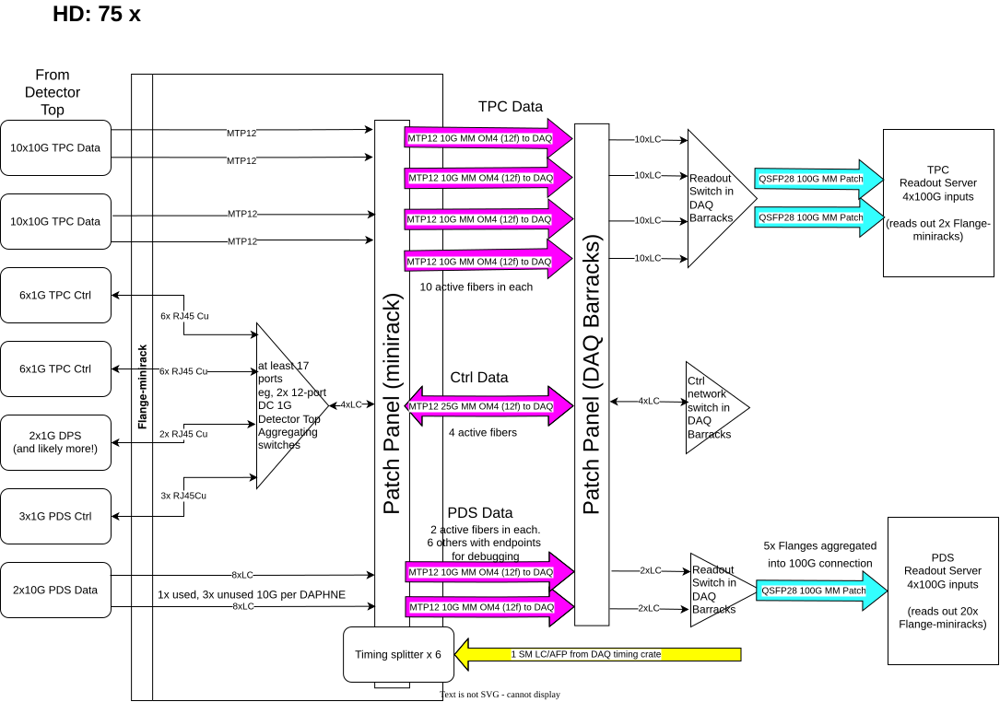
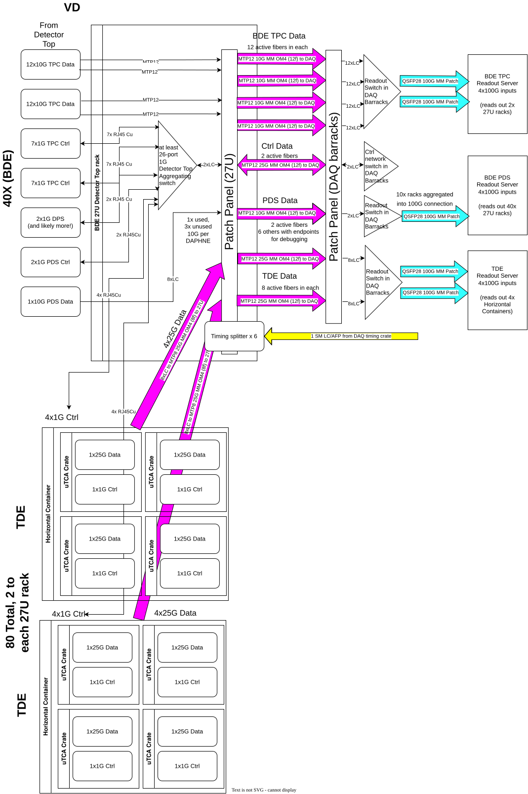
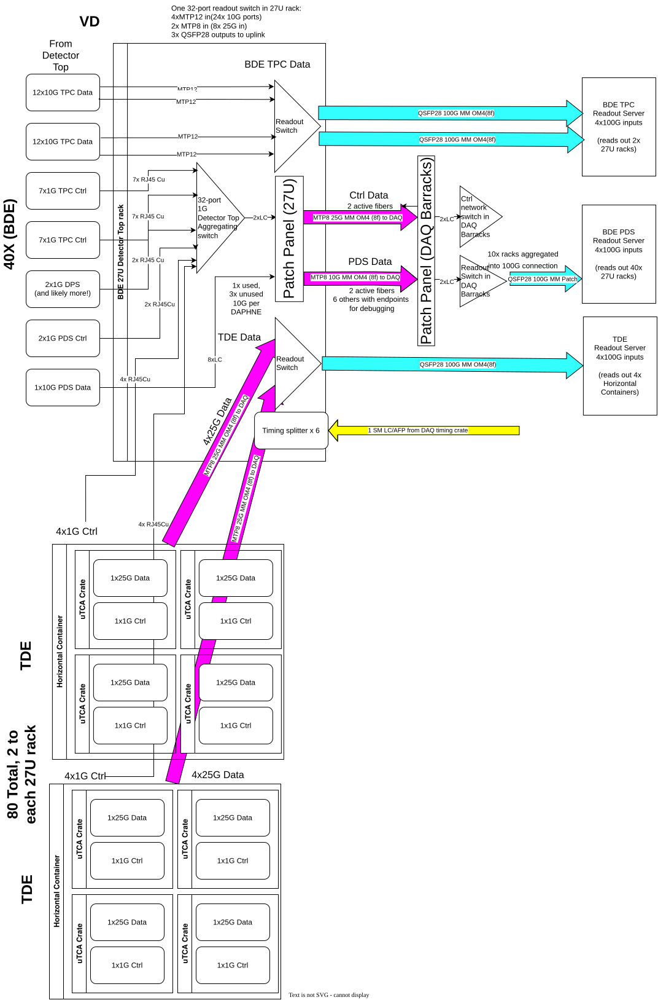

# Diagram index

Auto-generated by `scripts/generate-index.py` -- do not hand-edit,
re-run the script instead.

- [Facilities_and_Infrastructure](#facilities_and_infrastructure)

## Facilities_and_Infrastructure

| Diagram | Preview | Edit |
|---|---|---|
| DUNE_Detector_Fiber_Plant-v3-HD_Fiber_Plant |  | [Open in draw.io](https://app.diagrams.net/#Hwesketchum%2Fdunedaq-diagrams%2Fmain%2Fsrc%2FFacilities_and_Infrastructure%2FDUNE_Detector_Fiber_Plant-v3-HD_Fiber_Plant.drawio) |
| DUNE_Detector_Fiber_Plant-v3-VD_Fiber_Plant |  | [Open in draw.io](https://app.diagrams.net/#Hwesketchum%2Fdunedaq-diagrams%2Fmain%2Fsrc%2FFacilities_and_Infrastructure%2FDUNE_Detector_Fiber_Plant-v3-VD_Fiber_Plant.drawio) |
| DUNE_Detector_Fiber_Plant-v3-VD_Fiber_Plant_Detector_Top_Readout |  | [Open in draw.io](https://app.diagrams.net/#Hwesketchum%2Fdunedaq-diagrams%2Fmain%2Fsrc%2FFacilities_and_Infrastructure%2FDUNE_Detector_Fiber_Plant-v3-VD_Fiber_Plant_Detector_Top_Readout.drawio) |
